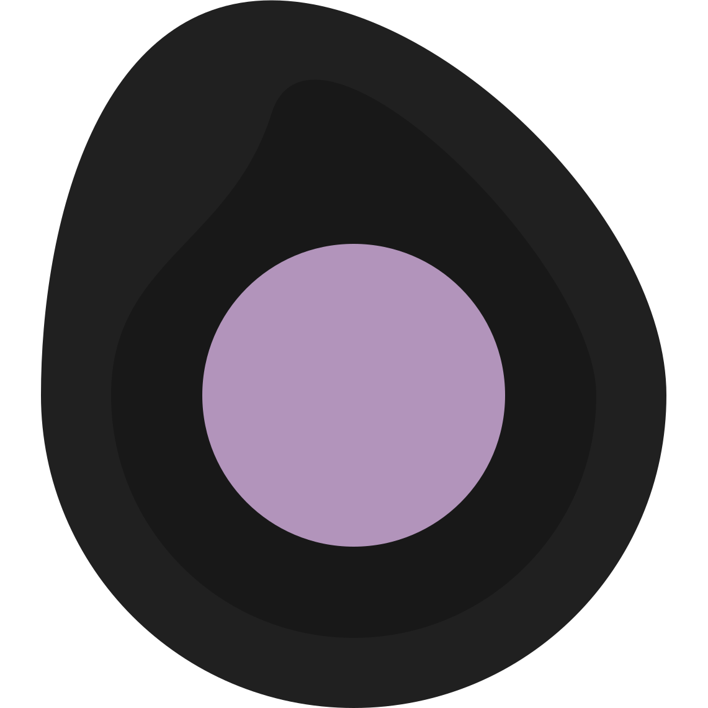

# Tomorrow Night Darkly

A [Simply Dark](https://simplydark.net) Theme

## Chrome Theme

[Add to Chrome](https://chrome.google.com/webstore/detail/tomorrow-night-darkly/najhldfogkjhgdaaloddlfdgjfolnoik) from the Chrome Web Store.

## GitHub Theme

A custom dark theme for GitHub that replaces the default color palette with the Tomorrow Night Darkly aesthetic. Requires the [Stylus](https://chromewebstore.google.com/detail/stylus/clngdbkpkpeebahjckkjfobafhncgmne) browser extension.

[Install GitHub Theme](https://userstyles.world/style/27011/tomorrow-night-darkly-github) from UserStyles.world.

### What it covers

- Backgrounds, text, borders, and overlays
- Contribution graph (purple gradient)
- Success/open states, diff views, and progress bars
- Buttons, controls, tooltips, menus, and navigation
- CodeMirror editor syntax highlighting
- Header, avatars, topic tags, and timeline badges
- 470+ Primer design token overrides

## Mattermost Theme

A custom dark theme for Mattermost matching the Tomorrow Night Darkly palette.

Open **Settings -> Display -> Theme -> Custom Theme -> Import theme colors** and paste the contents of [`mattermost/tomorrow-night-darkly.json`](mattermost/tomorrow-night-darkly.json). Full install steps and the color mapping are in the [Mattermost theme README](mattermost/README.md).

## Firefox Theme

A dark theme for Firefox mirroring the Chrome theme's palette. Load it via `about:debugging -> This Firefox -> Load Temporary Add-on` and select [`firefox/theme/manifest.json`](firefox/theme/manifest.json). See the [Firefox theme README](firefox/README.md) for details.

## VS Code Theme

A dark color theme for VS Code, keyword-forward pink with a full workbench and syntax map. Copy the [`vscode/`](vscode/) folder into your extensions directory (or build a `.vsix` with `vsce package`), then pick **Tomorrow Night Darkly** in the theme selector. See the [VS Code theme README](vscode/README.md).

## Slack Theme

A dark sidebar theme for Slack. Copy the color string from [`slack/tomorrow-night-darkly.txt`](slack/tomorrow-night-darkly.txt) and paste it into **Preferences -> Themes -> Create a custom theme**. See the [Slack theme README](slack/README.md).

## Discord Theme

A dark theme for Discord via BetterDiscord/Vencord. Drop [`discord/tomorrow-night-darkly.theme.css`](discord/tomorrow-night-darkly.theme.css) into your Themes folder and enable it. Best-effort (Discord internals shift); see the [Discord theme README](discord/README.md).

## Terminal Theme

A 16-color ANSI scheme for terminals. iTerm2 users import [`terminal/tomorrow-night-darkly.itermcolors`](terminal/tomorrow-night-darkly.itermcolors); Windows Terminal users add [`terminal/windows-terminal.json`](terminal/windows-terminal.json) to their `schemes`. A generic color table for any other terminal is in the [terminal theme README](terminal/README.md).
